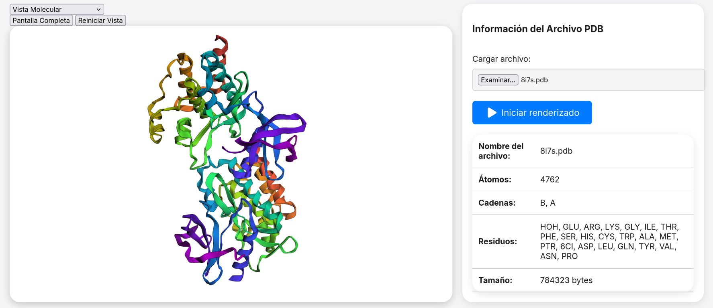
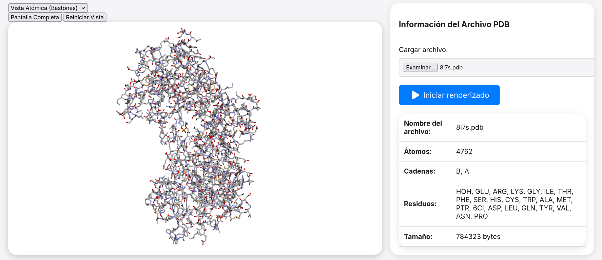
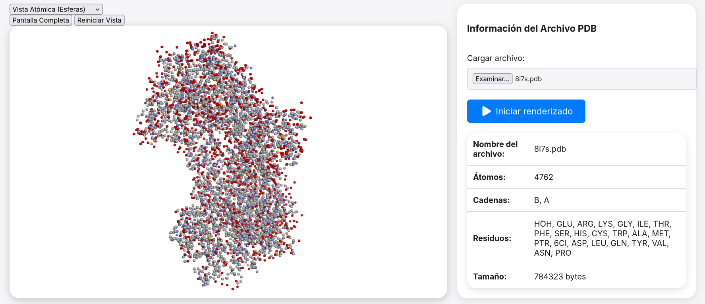

# Visor Molecular 3D

Este proyecto es una aplicación interactiva que permite cargar archivos PDB y visualizar estructuras moleculares en diferentes modos. Los usuarios pueden alternar entre **Vista Molecular**, **Vista Atómica (Bastones)** y **Vista Atómica (Esferas)**, además de opciones como "Pantalla Completa" y "Reiniciar Vista".

## Funcionalidades principales

- **Carga de archivos PDB:** Carga y procesa archivos `.pdb` con información sobre átomos, cadenas y residuos.
- **Modos de visualización:**
  - **Vista Molecular:** Representación por estructuras secundarias en un estilo "cartoon".
  - **Vista Atómica (Bastones):** Representación detallada con bastones que muestran los enlaces.
  - **Vista Atómica (Esferas):** Representación con esferas para cada átomo.
- **Opciones interactivas:**
  - Alternar entre modos de visualización.
  - Ampliar a pantalla completa.
  - Reiniciar la vista al centro.

## Capturas de pantalla

### Vista Molecular


_Representación "cartoon" de la estructura molecular._

---

### Vista Atómica (Bastones)


_Estructura atómica mostrada con bastones que destacan los enlaces._

---

### Vista Atómica (Esferas)


_Estructura atómica representada con esferas para cada átomo._

## Cómo ejecutar el proyecto

1. Clona este repositorio:
   ```bash
   git clone https://github.com/isgaar/SimuladorMolecular.git


⠀⠀⠀⠀⠀   ⣠⡖⠒⢤⣠⡤⠀⢒⣲⣬⣭⣭⣭⣶⣤⣤⡤⠤⠒⣼⡅⠀
⠀⠀⠀⠀⠀⠀ ⡟⣉⣙⣲⠔⠘⠿⠿⣿⣿⣿⣿⣿⣿⣿⣿⣿⣌⡳⣴⣿⠀
⠀⠀⠀⠀⠀⠀⠀⢳⣘⠟⠀⠀⠀⢠⡾⠛⢉⠛⡿⡟⡳⢬⣭⣴⡌⠻⡇⠀⠀
⠀⠀⠀⠀⠀⠀⠰⢞⣭⠀⠀⠀⠀⢸⣇⠫⠉⢓⡶⠃⢉⢶⣭⡽⢀⠀⢱⠀⠀
⠀⠀⠀⠀⠀⢘⣇⣾⡿⠀⠀⠀⠀⠹⢿⣿⣿⡏⠀⠁⠀⠀⠹⡀⠈⠉⡟⠀⠀
⠀⠀⣠⣶⠞⣽⣿⡕⣡⠀⠀⠀⢀⣠⣭⣿⠇⠀⡴⣶⢾⣶⡽⡄⠀⡇⠀⠀
⠀⠀⣴⣿⣿⠇⣸⣿⣿⠞⣡⠞⡄⠀⠞⠻⠿⢿⣧⣀⢻⡏⣾⡿⠇⣷⣾⡇⠀⠀
⢠⣾⣿⡟⠁⠀⢼⣿⣿⡟⣡⡾⠃⣠⢶⣶⣦⣜⠿⣿⡦⠥⠿⢋⣰⣿⣿⣿⡄⠀
⢸⣿⠏⣠⡀⠀⣿⣿⣿⣿⣿⡤⣐⡁⢻⣿⣿⣿⡿⣷⣶⣿⣿⣿⣿⣿⣿⣿⣿⡄
⢹⣟⣼⣷⣿⡀⣻⣿⣿⣿⣿⣿⡿⢠⣄⡄⡁⠈⠘⢁⢿⣿⣿⣿⣿⣿⣿⣿⣿⠃
⠨⠿⡿⢿⣿⣷⣿⣿⠿⣿⣿⣟⣴⣼⣿⣇⣷⣷⣷⣾⣿⣿⣿⣿⣿⣿⡟⠇⠀
⠀⠀⠀⠈⠹⠉⠀⠀⠀⠘⠙⢻⠟⢿⣿⣿⣿⣿⣿⣿⣿⣿⣿⠻⣿⠿⡿⠇⠁⠀⠀

- Desarrollado por: Ismael Gaspar Cruz -
*